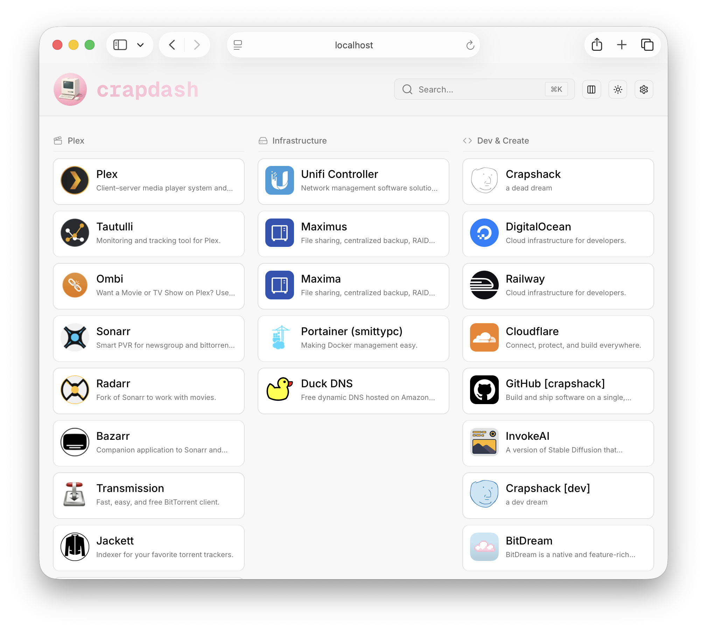
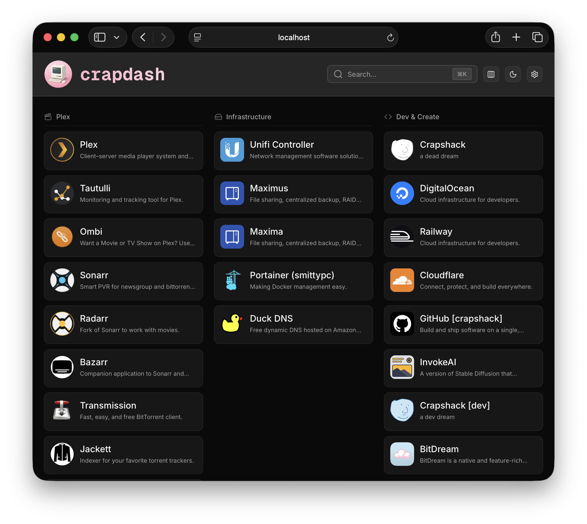

<p align="center">
  
</p>

# crapdash

A low-frills, customizable homepage to organize your links and services. Group them into categories and access everything from one place.

<p align="center">
  
  
</p>

## Features

- **Services**: Save links with names, descriptions, and custom icons
- **Categories**: Group services by project, team, or whatever makes sense
- **Admin panel**: Manage services and categories through a simple UI

## Installation

### Docker

```bash
docker run -d \
  --name crapdash \
  -p 2727:2727 \
  --mount type=bind,source=/path/to/data,target=/app/data \
  --restart=unless-stopped \
  ghcr.io/crapshack/crapdash:latest
```

### Docker Compose

```yaml
services:
  crapdash:
    image: ghcr.io/crapshack/crapdash:latest
    container_name: crapdash
    restart: unless-stopped
    ports:
      - "2727:2727"
    volumes:
      - ./crapdash:/app/data
```

## Stack


