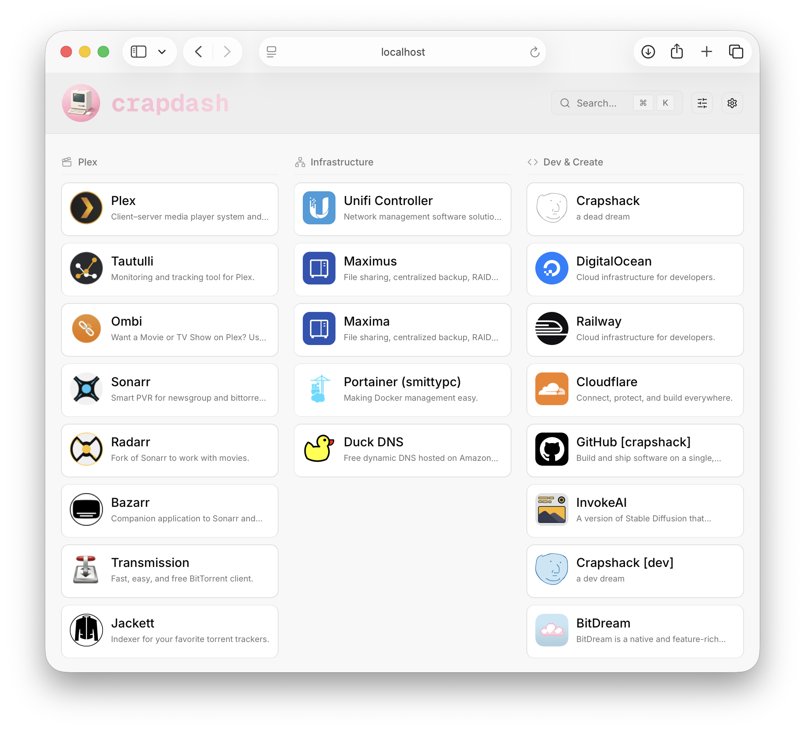
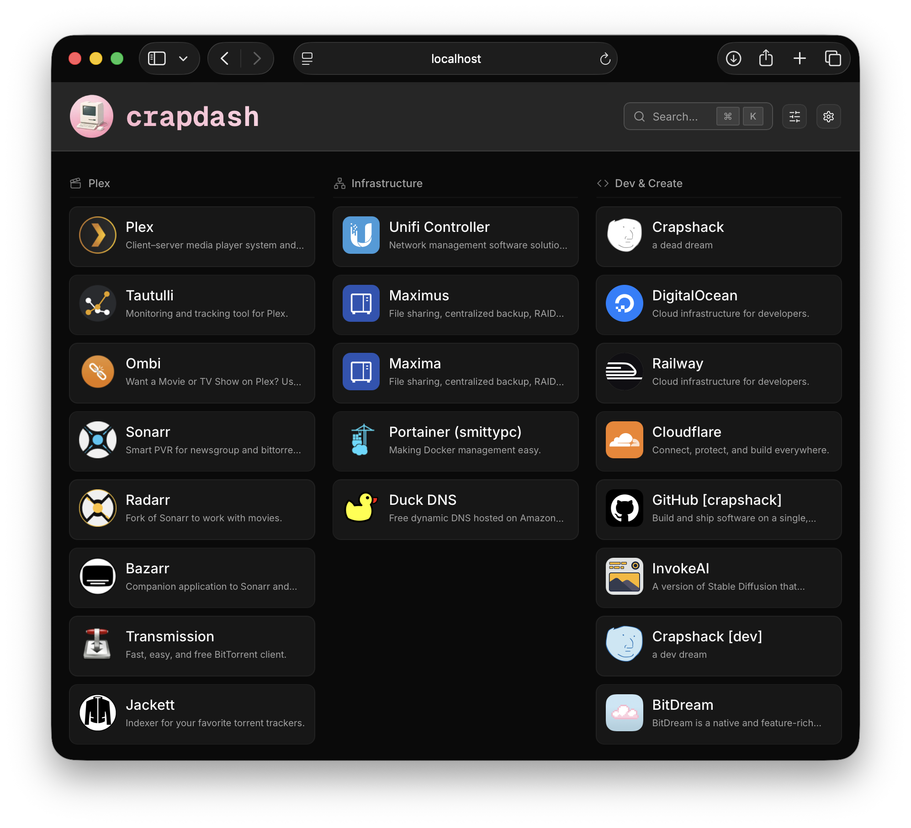

<!-- LOGO -->
<h1 align="center">
  
  <br>crapdash
</h1>
<p align="center">
  Low-frills, customizable homepage to organize your links and services.
</p>

## About

Crapdash is a low-frills homepage to manage your links and services. Add names, descriptions, and icons, and organize everything into categories using the built-in admin panel.

<p align="center">
  
  
</p>

## Features

- **Services**: Save links with names, descriptions, and custom icons
- **Categories**: Group services into categories with drag-and-drop organization
- **Admin panel**: Manage services and categories through a simple UI
- **Search**: Filter services quickly

## Installation

### Docker

```bash
docker run -d \
  --name crapdash \
  -p 2727:2727 \
  --mount type=bind,source=/path/to/data,target=/app/data \
  --restart=unless-stopped \
  ghcr.io/crapshack/crapdash:latest
```

### Docker Compose

```yaml
services:
  crapdash:
    image: ghcr.io/crapshack/crapdash:latest
    container_name: crapdash
    restart: unless-stopped
    ports:
      - "2727:2727"
    volumes:
      - ./crapdash:/app/data
```

### Prebuilt Bundle

Download and run the latest prebuilt bundle if you want a quick Node deploy without Docker.

1) Download the latest release from the [Releases](https://github.com/crapshack/crapdash/releases) page and extract it where you want to run it.
2) Ensure the extracted `data/` directory is writable (config and uploads live there).
3) Start the server:

```bash
cd /path/to/crapdash
PORT=2727 node .next/standalone/server.js
```

Consider using a process manager (e.g., pm2, systemd, launchd, NSSM) and a reverse proxy (nginx, Caddy, etc.).

## Stack


